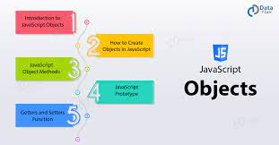

>>>>>>>>>> #### JavaScript     >>>>>>>>>>>

# HOW HTML, CSS, & JAVASCRIPT FIT TOGETHER

_JavaScript is the Programming Language for the Web. JavaScript can update and change both HTML and CSS. JavaScript can calculate, manipulate and validate data._
  
_JavaScript is a programming language that adds interactivity to your website. This happens in games, in the behavior of responses when buttons are pressed or with data entry on forms; with dynamic styling; with animation, etc. This article helps you get started with JavaScript and furthers your understanding of what is possible._
***
_JavaScript is one of the most popular modern web technologies! As your JavaScript skills grow, your websites will enter a new dimension of power and creativity.

However, getting comfortable with JavaScript is more challenging than getting comfortable with HTML and CSS. You may have to start small, and progress gradually. To begin, **let's examine how to add JavaScript to your page** _
***

_1. Go to your test site and create a new folder named scripts. Within the scripts folder, create a new file called main.js, and save it._
****

_2. In your index.html file, enter this code on a new line, just before the closing </body> tag:_
***
## Wha is variale 

***
var <variable-name>;

var <variable-name> = <value>;

var one = 1;       // variable stores numeric value

var two = 'two';  // variable stores string value

var three;       // declared a variable without assigning a value
=======
var one = 1; // variable stores numeric value

var two = 'two';  // variable stores string value

var three;  // declared a variable without assigning a value

***
In the above example, we have declared three variables using var keyword: one, two and three. We have assigned values to variables one and two at the same time when we declared it, whereas variable three is declared but does not hold any value yet, so it's value will be 'undefined'.

Declare Variables in a Single Line
Multiple variables can also be declared in a single line separated by comma.

Example: Multiple Variables in a Single Line
var one = 1, two = 'two', three;

***
## How To Use Object Methods in JavaScript
_Objects in JavaScript are collections of key/value pairs. The values can consist of properties and methods, and may contain all other JavaScript data types, such as strings, numbers, and Booleans.
All objects in JavaScript descend from the parent Object constructor. Object has many useful built-in methods we can use and access to make working with individual objects straightforward. Unlike Array prototype methods like sort() and reverse() that are used on the array instance, Object methods are used directly on the Object constructor, and use the object instance as a parameter. This is known as a static method.
This tutorial will go over important built-in object methods, with each section below dealing with a specific method and providing an example of use._

****
#####  JavaScript Arithmetic Operators
Arithmetic operators perform arithmetic on numbers (literals or variables).

**If You want More Ideas Abour Operators Please Visit This Site**
Here [Operators](https://www.tutsmake.com/javascript-arithmetic-operators-example/)

****
##### JavaScript Output
JavaScript Display Possibilities
JavaScript can "display" data in different ways:

* Writing into an HTML element, using **innerHTML.** 
* Writing into the HTML output using **document.write().** 
* Writing into an alert box, using ** window.alert().** 
 *Writing into the browser console, using ** console.log().** 

****

