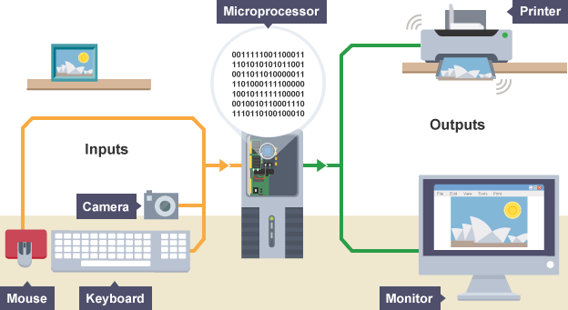

<<<<<<<<<<<<<<<<<*First Computer In History*>>>>>>>>>>>>>>>
 
****

_It was probably the worst prediction in history. Back in the 1940s, Thomas Watson, boss of the giant IBM Corporation, reputedly forecast that the world would need no more than "about five computers." Six decades later and the global population of computers has now risen to something like one billion machines!_
_To be fair to Watson, computers have changed enormously in that time. In the 1940s, they were giant scientific and military behemoths commissioned by the government at a cost of millions of dollars apiece; today, most computers are not even recognizable as such: they are embedded in everything from microwave ovens to cellphones and digital radios. What makes computers flexible enough to work in all these different appliances? How come they are so phenomenally useful? And how exactly do they work? Let's take a closer look!_
***
***
# Computers
_A computer is a **machine** composed of hardware and software components. A computer receives data through an input unit based on the instructions it is given and after it processes the data, it sends it back through an output device. How does this come together to make the computer work?_

_The input devices of a computer can depend on the type of computer we are dealing with but most typically we will find a mouse, keyboard, scanner or even applications (software) installed on the computer. Once the data has been received, the central processing unit (CPU) along with the help of other components, takes over and processes the information it was given. Once the data is ready, it will be sent back through an output device which can be a monitor, speaker, printer, ports, etc._

_To better imagine how a computer works, knowing what’s inside will make it easier. Here are the main components of a computer:_

_**CPU** – or Central Processing Unit is considered the most important component in a computer and for good reason. It handles most operations that make it function, by processing instructions and giving signals out to other components. The CPU is the main bridge between all the computer’s major parts._
_**RAM** – Random Access Memory, or RAM for short, is a computer component where data used by the operating system and software applications store data so that the CPU can process them quickly. Everything stored on RAM is lost if the computer is shut off. Depending on the applications you use, there is typically a maximum limit of RAM you will need for the computer to function properly._
_**HDD** – Also known as Hard Disk Drive, it is the component where photos, apps, documents and such are kept. Although they are still being used, we have much faster types of storage devices such as solid state drives (SSD) that are also more reliable._
_**Motherboard** – There is no acronym for this component but without it, there can’t be a computer. The Motherboard acts as the home for all other components, allows them to communicate with each other and gives them power in order to function. There are components that don’t require a physical connection to the Motherboard in order to work, such as Bluetooth or Wi-Fi but, if there is no connection or signal what so ever, the computer won’t know it’s there._
_**Video and Sound Cards** – Two components which help the user interact with the computer. Although one can use a computer with a missing sound card, it’s not really possible to use it without a video card. The sound card is used mainly to play sound through a speaker. However, a video card is used to send images on the screen. Without it, it would be like looking at an empty monitor.
**Network adapter** – Even though it is not actually required to operate the computer, the Network adapter improves the user’s experience as it provides access to the internet. Modern computers with operating systems such as Windows 10 will not offer the user all of its features without an Internet connection._
_If you are having trouble with any of your computer’s internal or external components, please do not hesitate to contact Geeks on Site. Our experienced techs are ready to help you with any computer issues and are often able to do so remotely by walking you through a few steps to give them access to your computer._
_In the 1940s, the worst prediction in history was when Thomas Watson, president of the giant IBM Corporation, predicted that the world would need no more than "about five computers." Six decades later, the number of computers in the world has now grown to nearly a billion!
What is a computer : it is an electronic machine that processes information, meaning in other words it is called an information processor. The processing process is carried out on the data that is entered through the media, and then it processes that data after analyzing it and storing it in the memory and then sending it to the output tools in the computer_

1._ **Input**: Your keyboard and mouse, for example, are just input units—ways of getting information into your computer that it can process. If you use a microphone and voice recognition software, that's another form of input.
2. **Memory/storage**: Your computer probably stores all your documents and files on a hard drive: a huge magnetic memory. But smaller, computer-based devices like digital cameras and cellphones use other kinds of storage such as flash memory cards.
3. **Processing**: Your computer's processor (sometimes known as the central processing unit) is a microchip buried deep inside. It works amazingly hard and gets incredibly hot in the process. That's why your computer has a little fan blowing away—to stop its brain from overheating!
4. **Output**: Your computer probably has an LCD screen capable of displaying high-resolution (very detailed) graphics, and probably also stereo loudspeakers. You may have an inkjet printer on your desk too to make a more permanent form of output._

***
**Example for input output**

***
### What's the difference between hardware and software?
_The beauty of a computer is that it can run a word-processing program one minute—and then a photo-editing program five seconds later. In other words, although we don't really think of it this way, the computer can be reprogrammed as many times as you like. This is why programs are also called software. They're "soft" in the sense that they are not fixed: they can be changed easily. By contrast, a computer's hardware—the bits and pieces from which it is made (and the peripherals, like the mouse and printer, you plug into it)—is pretty much fixed when you buy it off the shelf. The hardware is what makes your computer powerful; the ability to run different software is what makes it flexible. That computers can do so many different jobs is what makes them so useful—and that's why millions of us can no longer live without them!_
***
## How Computers Work

***
_The most basic way of thinking of a computer is as an Input/Output machine. That’s a pretty basic idea: computers take information from external sources (your keyboard, mouse, sensors or the internet), store it, process it, and return the result (Output) of that process. By the way, if you think about it, the moment computers are connected through the internet there’s an ever ending loop of inputs and outputs as the output of a computer (say a website) becomes the input of another and so forth(!!)._
_Now, we are all pretty used and familiar with the ways a computer has to receive input and to print out some output, we’ve all used a mouse or a keyboard, or even talked to a computer and we’ve all read an article on a website, listened to music or browsed through some old pictures, etc. What we ain’t as familiar with, and what we usually struggle to understand is how a computer actually processes information._
_So yes, on a very fundamental level all a computer understands is 1’s and 0’s which means that every single input and output gets at some point translated into or from 1’s and 0s. What is powerful about 1’s and 0’s (also called bits -from BInary digiT) is that it allows us to transform any information into electrical signals (ON/OFF). Please take a moment to think about it: ANYTHING you see, think or interact with can actually be translated and represented as electrical signals(!!!). Representing information as electrical signals is what allows computers to actually process that information and transform it._
***

### Bits and binary
Computers use binary - the digits 0 and 1 - to store data. A binary digit, or bit, is the smallest unit of data in computing. It is represented by a 0 or a 1. Binary numbers are made up of binary digits (bits), eg the binary number 1001.

The circuits in a computer's processor are made up of billions of transistors. A transistor is a tiny switch that is activated by the electronic signals it receives. The digits 1 and 0 used in binary reflect the on and off states of a transistor.

Computer programs are sets of instructions. Each instruction is translated into machine code - simple binary codes that activate the CPU. Programmers write computer code and this is converted by a translator into binary instructions that the processor can execute.

All software, music, documents, and any other information that is processed by a computer, is also stored using binary.

**Encoding**
_Everything on a computer is represented as streams of binary numbers. Audio, images and characters all look like binary numbers in machine code. These numbers are encoded in different data formats to give them meaning, eg the 8-bit pattern 01000001 could be the number 65, the character 'A', or a colour in an image._

_Encoding formats have been standardised to help compatibility across different platforms. For example:
audio is encoded as audio file formats, eg mp3, WAV, AAC
video is encoded as video file formats, eg MPEG4, H264
text is encoded in character sets, eg ASCII, Unicode
images are encoded as file formats, eg BMP, JPEG, PNG
The more bits used in a pattern, the more combinations of values become available. This larger number of combinations can be used to represent many more things, eg a greater number of different symbols, or more colours in a picture._
***